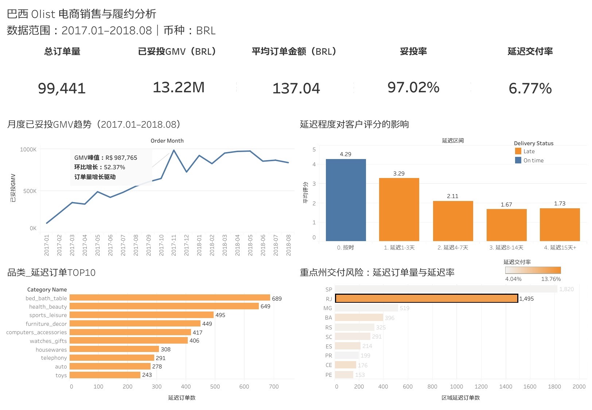

# 巴西 Olist 电商销售与履约分析

基于巴西 Olist 电商平台约 10 万笔订单，使用 **MySQL 8.0** 完成多表建模、数据质量检查与业务指标计算，并使用 **Tableau Public** 搭建销售与履约分析仪表板，定位影响客户体验的交付问题。

## 在线仪表板

[查看 Tableau Public 可视化作品](https://public.tableau.com/app/profile/tonia.tan/viz/olist_ecommerce_analysis_17843408102550/sheet9)



## 数据来源

- [Brazilian E-Commerce Public Dataset by Olist](https://www.kaggle.com/datasets/olistbr/brazilian-ecommerce)
- 数据包含订单、客户、商品、订单明细、支付、评价及品类翻译等多张业务表。
- 原始数据未上传至本仓库，请从上述页面下载。

## 分析目标

1. 衡量订单规模、GMV、平均订单金额和整体履约表现。
2. 观察完整月份内的销售趋势及异常波动。
3. 分析交付延迟程度与客户评分之间的关系。
4. 识别延迟订单集中的重点品类和地区，为履约优化提供依据。

## 数据处理与指标口径

- 使用 `order_id`、`customer_id`、`product_id` 等业务主键连接 7 张核心数据表。
- 先在订单粒度聚合订单明细、支付和评价，避免多对多连接造成金额重复计算。
- GMV：已妥投订单的商品金额之和，不包含运费。
- 妥投率：已妥投订单数 / 全部订单数。
- 延迟交付：实际送达日期晚于预计送达日期。
- 延迟交付率：延迟订单数 / 具备完整交付日期的已妥投订单数。
- 月度趋势使用 2017-01 至 2018-08 的完整分析期，排除边界残缺月份。

## 核心指标

| 指标 | 结果 |
|---|---:|
| 总订单量 | 99,441 |
| 已妥投订单量 | 96,478 |
| 已妥投 GMV | 13,221,498.11 BRL |
| 平均订单金额 | 137.04 BRL |
| 妥投率 | 97.02% |
| 延迟订单量 | 6,534 |
| 延迟交付率 | 6.77% |

## 主要发现

1. **销售增长明显但存在月度波动**：2017-11 的 GMV 达到约 98.78 万 BRL，环比增长 52.37%，主要由订单量增长驱动。
2. **交付延迟显著影响客户体验**：按时订单平均评分为 4.29；延迟 1—3 天降至 3.29；延迟 4—7 天进一步降至 2.11；延迟 15 天以上仅为 1.73。
3. **重点品类延迟量集中**：`bed_bath_table` 和 `health_beauty` 的延迟订单量分别为 689 和 649，需优先排查供应与配送环节。
4. **地区需结合“规模”和“比例”判断**：SP、RJ 的延迟订单绝对量较高；RJ、BA、CE 的延迟率也相对突出，应分别采取运力扩充与流程排查措施。

## 业务建议

- 对 SP、RJ 等延迟订单量较大的州增加高峰期运力和履约监控。
- 对 RJ、BA、CE 等延迟率较高的州进一步分析承运商、仓库和线路环节。
- 优先检查家居、健康美容等高延迟量品类的备货及发货时效。
- 对预计延迟超过 4 天的订单进行主动通知和客服干预，降低低评分风险。

## 项目文件

```text
olist-ecommerce-analysis/
├── README.md
├── sql/
│   └── olist_ecommerce_analysis.sql
├── tableau/
│   └── olist_ecommerce_analysis.twbx
└── screenshots/
    └── olist_dashboard.png
```

## 工具与能力

- **MySQL 8.0**：建库建表、CSV 导入、多表连接、CTE、窗口函数、条件聚合、数据质量检查、视图建设。
- **Tableau Public**：计算字段、KPI 卡片、趋势分析、分类排名、仪表板排版与在线发布。
- **业务分析**：指标口径设计、订单粒度控制、销售趋势分析、履约与客户体验关联分析。

## 复现步骤

1. 从 Kaggle 下载原始 CSV 文件并放入本地 `data` 目录。
2. 修改 SQL 文件中的本地数据路径。
3. 按顺序执行建库、建表、导入、质量检查和视图创建部分。
4. 使用 `vw_order_dashboard` 和 `vw_category_dashboard` 作为 Tableau 数据源。
5. 打开打包工作簿或访问在线仪表板查看结果。

